# AWS EKS CI/CD Pipeline

This project deploys a containerized Node.js application to Amazon EKS using Docker, Amazon ECR, Terraform, Helm, Kubernetes autoscaling, an AWS Application Load Balancer, and Jenkins CI/CD.

## Project Overview

The application is a simple Node.js and Express web application that displays:

```text
Hello, World!
```

The project demonstrates a cloud deployment workflow that includes:

- Application development with Node.js
- Docker containerization
- Amazon ECR image storage
- Infrastructure as Code with Terraform
- Kubernetes orchestration with Amazon EKS
- Helm-based application deployment
- Horizontal Pod Autoscaling
- EKS worker node autoscaling
- Public access through an AWS Application Load Balancer
- Jenkins CI/CD automation

## Technologies Used

- AWS
- Amazon EKS
- Amazon ECR
- EC2
- AWS Application Load Balancer
- Terraform
- Docker
- Kubernetes
- Helm
- Jenkins
- Node.js
- Express
- GitHub

## Architecture

```text
Developer
    |
    v
GitHub Repository
    |
    v
Jenkins CI/CD
    |
    +--> Build Docker Image
    |
    +--> Push Image to Amazon ECR
    |
    +--> Deploy with Helm
    |
    v
Amazon EKS
    |
    +--> Kubernetes Deployment
    |
    +--> Horizontal Pod Autoscaler
    |
    +--> Cluster Autoscaler
    |
    v
AWS Application Load Balancer
    |
    v
Public Hello World Application
```

## Project Structure

```text
aws-eks-cicd-pipeline/
├── Jenkinsfile
├── README.md
├── app/
│   ├── server.js
│   ├── package.json
│   ├── package-lock.json
│   └── Dockerfile
├── terraform/
│   ├── provider.tf
│   ├── variables.tf
│   ├── vpc.tf
│   ├── eks.tf
│   ├── ecr.tf
│   └── outputs.tf
├── helm/
│   └── hello-world/
│       ├── Chart.yaml
│       ├── values.yaml
│       └── templates/
│           ├── deployment.yaml
│           ├── service.yaml
│           ├── ingress.yaml
│           └── hpa.yaml
├── cluster-autoscaler-policy.json
├── iam_policy.json
└── screenshots/
```

# Local Application

The application is built with Node.js and Express and listens on port `3000`.

Run the application locally:

```bash
cd app
npm install
npm start
```

Open:

```text
http://localhost:3000
```

Expected output:

```text
Hello, World!
```

### Node.js Application Running

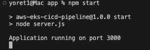

### Local Application

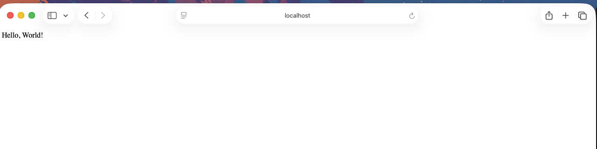

# Docker

The application is containerized using Docker.

Build the image:

```bash
docker build -t aws-eks-cicd-pipeline ./app
```

Run the container:

```bash
docker run -p 3000:3000 aws-eks-cicd-pipeline
```

Verify the running container:

```bash
docker ps
```

### Docker Container Running

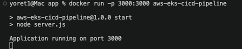

### Dockerized Application

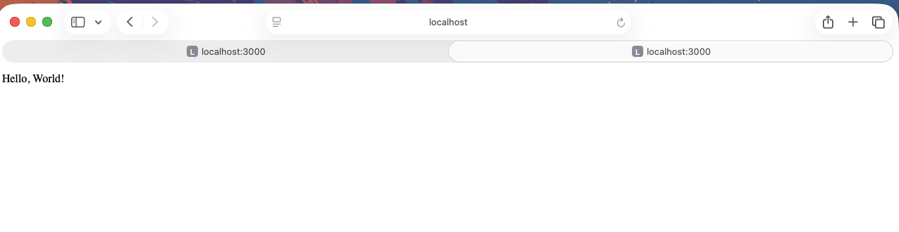

For the EKS deployment, the image was built for the Linux AMD64 platform:

```bash
docker buildx build \
  --platform linux/amd64 \
  -t 678817681968.dkr.ecr.us-east-1.amazonaws.com/aws-eks-cicd-pipeline:latest \
  --push \
  ./app
```

# GitHub Repository

The project is version controlled using Git and stored in a private GitHub repository.

Repository name:

```text
aws-eks-cicd-pipeline
```

### GitHub Repository

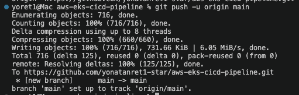

# Amazon ECR

Amazon Elastic Container Registry is used to store the Docker images.

ECR repository:

```text
aws-eks-cicd-pipeline
```

Authenticate Docker to ECR:

```bash
aws ecr get-login-password --region us-east-1 \
| docker login \
  --username AWS \
  --password-stdin \
  678817681968.dkr.ecr.us-east-1.amazonaws.com
```

Push the image:

```bash
docker push \
678817681968.dkr.ecr.us-east-1.amazonaws.com/aws-eks-cicd-pipeline:latest
```

### Docker Image Push to ECR

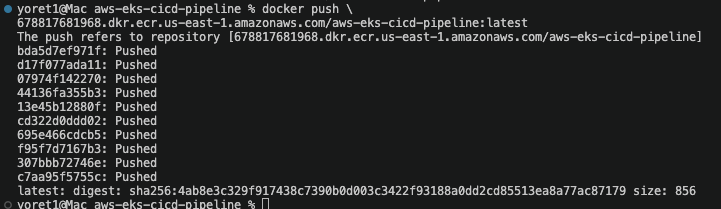

### ECR Repository Image

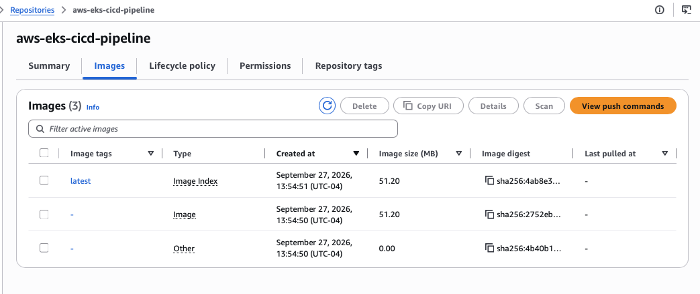

# Terraform Infrastructure

Terraform is used to provision the AWS infrastructure.

The Terraform configuration creates:

- VPC
- Public subnets
- Internet Gateway
- Route tables
- Amazon EKS cluster
- EKS managed node group
- Amazon ECR repository
- IAM roles and policies

Initialize Terraform:

```bash
cd terraform
terraform init
```

Format the configuration:

```bash
terraform fmt
```

Validate the configuration:

```bash
terraform validate
```

Review the deployment plan:

```bash
terraform plan
```

Create the infrastructure:

```bash
terraform apply
```

# Amazon EKS

The Amazon EKS cluster is named:

```text
aws-eks-cicd-cluster
```

The managed node group is:

```text
application-nodes
```

Worker node instance type:

```text
t3.small
```

Node group scaling configuration:

```text
Minimum nodes: 1
Desired nodes: 1
Maximum nodes: 4
```

Configure local kubectl access:

```bash
aws eks update-kubeconfig \
  --region us-east-1 \
  --name aws-eks-cicd-cluster
```

Verify the worker nodes:

```bash
kubectl get nodes
```

# Helm Deployment

Helm is used to deploy and manage the application inside Amazon EKS.

Deploy the application:

```bash
helm upgrade --install hello-world ./helm/hello-world
```

Verify the application pod:

```bash
kubectl get pods
```

Verify the Kubernetes service:

```bash
kubectl get service
```

# Horizontal Pod Autoscaler

The application uses Kubernetes Horizontal Pod Autoscaler to scale application pods based on CPU and memory utilization.

Configuration:

```text
Minimum replicas: 1
Maximum replicas: 12
CPU target: 50%
Memory target: 50%
```

Verify the HPA:

```bash
kubectl get hpa
```

During testing, the HPA successfully reported CPU and memory utilization for the application.

### HPA Working

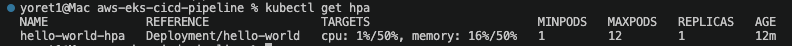

# Cluster Autoscaler

Cluster Autoscaler is used to automatically change the number of EKS worker nodes when additional Kubernetes capacity is required.

The EKS node group is configured with:

```text
Minimum nodes: 1
Maximum nodes: 4
```

The required Auto Scaling Group tags are:

```text
k8s.io/cluster-autoscaler/enabled = true
k8s.io/cluster-autoscaler/aws-eks-cicd-cluster = owned
```

Cluster Autoscaler uses IAM permissions through a Kubernetes service account and IAM Roles for Service Accounts.

Verify Cluster Autoscaler:

```bash
kubectl get pods -n kube-system | grep cluster-autoscaler
```

A temporary deployment was created with resource requests large enough that all pods could not fit on the original `t3.small` worker node.

The cluster automatically scaled from:

```text
1 worker node
```

to:

```text
3 worker nodes
```

### Cluster Autoscaler Scale Out

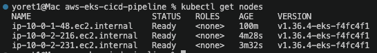

The test pods were then distributed across the available worker nodes.

### Pods Distributed Across Worker Nodes

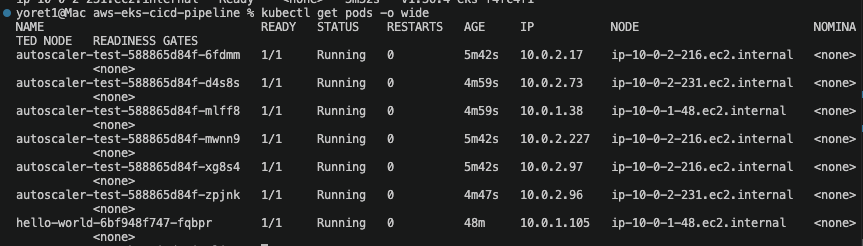

After the test, the temporary workload was removed:

```bash
kubectl delete deployment autoscaler-test
```

# AWS Load Balancer Controller

The AWS Load Balancer Controller is installed in the EKS cluster to manage AWS Application Load Balancers for Kubernetes Ingress resources.

Verify the controller:

```bash
kubectl get deployment \
  -n kube-system \
  aws-load-balancer-controller
```

The controller runs with two replicas:

```text
READY 2/2
```

# Application Load Balancer

The application is exposed publicly through an AWS Application Load Balancer.

The Kubernetes Ingress is configured with:

```text
Ingress Class: alb
Scheme: internet-facing
Target Type: ip
```

Verify the ingress:

```bash
kubectl get ingress
```

View detailed ingress information:

```bash
kubectl describe ingress hello-world
```

Traffic flow:

```text
Internet
    |
    v
AWS Application Load Balancer
    |
    v
Kubernetes Ingress
    |
    v
hello-world Service :80
    |
    v
Node.js Container :3000
```

### ALB Ingress

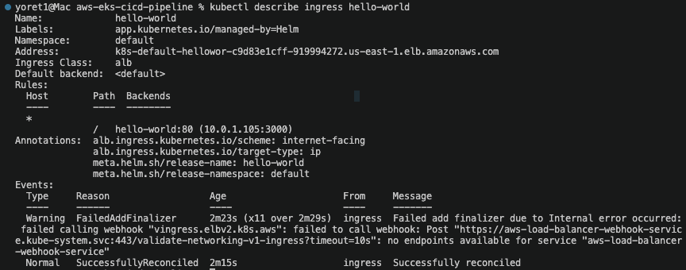

The application is publicly accessible through the generated AWS Application Load Balancer hostname.

### Public Application

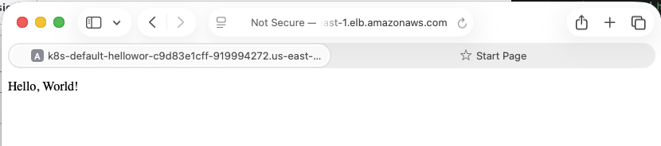

# Jenkins CI/CD

Jenkins is used to automate the application build and deployment process.

The Jenkins pipeline is configured to perform the following stages:

1. Checkout source code from GitHub
2. Build the Docker image
3. Authenticate to Amazon ECR
4. Push the Docker image to Amazon ECR
5. Configure access to Amazon EKS
6. Deploy the application using Helm
7. Verify the Kubernetes rollout

Each Jenkins build uses the Jenkins build number as the Docker image tag.

Example:

```text
aws-eks-cicd-pipeline:1
aws-eks-cicd-pipeline:2
aws-eks-cicd-pipeline:3
```

The Jenkins environment contains:

- Docker CLI
- AWS CLI
- kubectl
- Helm
- AWS credentials
- EKS kubeconfig
- GitHub repository access

Jenkins uses the following Kubernetes configuration:

```text
/var/jenkins_home/.kube/config
```

The Jenkins container was verified to successfully access the EKS cluster using:

```bash
kubectl get nodes
```

Pipeline flow:

```text
GitHub
    |
    v
Jenkins
    |
    v
Docker Build
    |
    v
Amazon ECR
    |
    v
Helm Upgrade
    |
    v
Amazon EKS
    |
    v
Kubernetes Deployment
    |
    v
AWS Application Load Balancer
```

The Jenkins pipeline completed successfully, including Docker build, ECR push, EKS configuration, Helm deployment, and deployment verification.
### Jenkins Pipeline Success

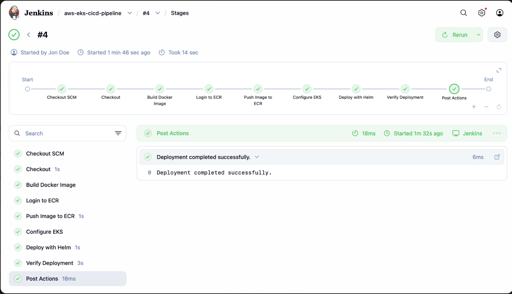

# Verification Commands

Check application pods:

```bash
kubectl get pods
```

Check application pods and their worker nodes:

```bash
kubectl get pods -o wide
```

Check EKS worker nodes:

```bash
kubectl get nodes
```

Check Horizontal Pod Autoscaler:

```bash
kubectl get hpa
```

Check Cluster Autoscaler:

```bash
kubectl get pods -n kube-system | grep cluster-autoscaler
```

Check AWS Load Balancer Controller:

```bash
kubectl get pods \
  -n kube-system \
  | grep aws-load-balancer-controller
```

Check the application ingress:

```bash
kubectl get ingress
```

# Screenshots

The project screenshots are stored in the `screenshots/` directory.

Current screenshots include:

```text
npm-start-success.png
hello-world-localhost.png
docker-container-running.png
hello-world-docker-browser.png
github-repository-initial-push.png
ecr-docker-push-success.png
ecr-repository-image.png
hpa-working.png
cluster-autoscaler-scale-out.png
cluster-autoscaler-pods-distributed.png
alb-ingress-success.png
hello-world-alb-public-url.png
```

These screenshots demonstrate:

- Local Node.js application execution
- Local browser access
- Docker container execution
- Dockerized browser access
- GitHub repository creation
- Amazon ECR image push
- Amazon ECR repository storage
- Kubernetes HPA operation
- EKS worker node autoscaling
- Kubernetes pod distribution
- ALB ingress configuration
- Public application access

# Cleanup

Remove the application from Kubernetes:

```bash
helm uninstall hello-world
```

Remove the temporary autoscaling test deployment if it exists:

```bash
kubectl delete deployment autoscaler-test
```

Destroy the Terraform-managed infrastructure:

```bash
cd terraform
terraform destroy
```

Review the Terraform destroy plan before confirming the destruction of AWS resources.

# Key Project Outcomes

This project demonstrates:

- Infrastructure as Code using Terraform
- Docker containerization
- Amazon ECR image storage
- Amazon EKS cluster deployment
- Kubernetes application deployment
- Helm package management
- Horizontal Pod Autoscaling
- EKS worker node autoscaling
- IAM integration using IRSA
- AWS Application Load Balancer integration
- Public application access
- Jenkins CI/CD configuration
- GitHub version control

# Repository Access

This repository is private and is shared with the project mentor for review.