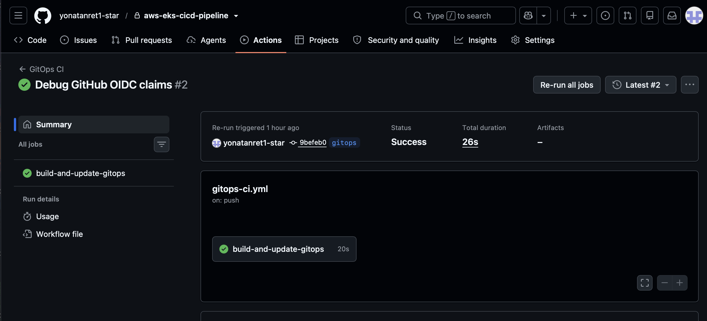
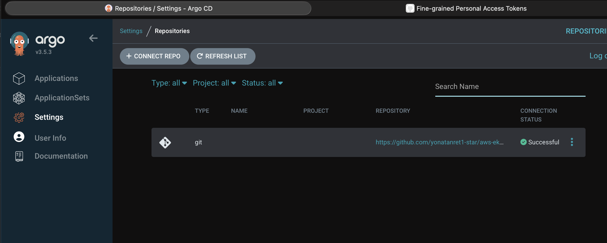
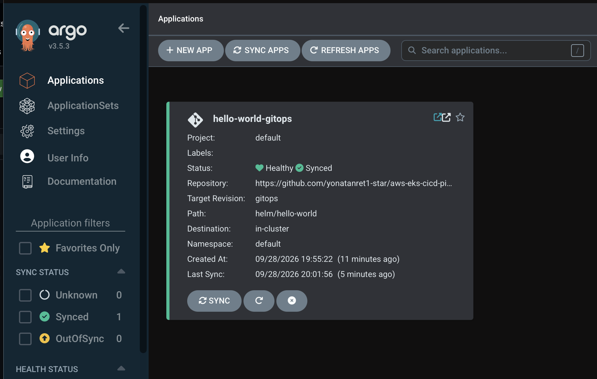
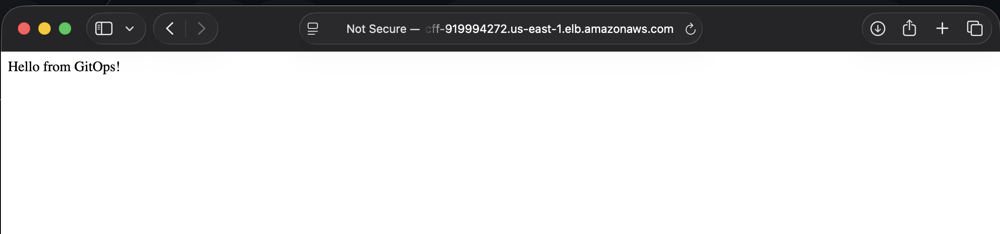

# AWS EKS CI/CD and GitOps Pipeline

## Project Overview

This project demonstrates an end-to-end containerized application deployment on AWS using Amazon EKS, Terraform, Docker, Amazon ECR, Helm, Kubernetes autoscaling, Jenkins CI/CD, GitHub Actions, and Argo CD.

The project implements two deployment approaches:

1. **Jenkins CI/CD**
   - Jenkins builds the Docker image.
   - Jenkins pushes the image to Amazon ECR.
   - Jenkins deploys the application to Amazon EKS using Helm.

2. **GitOps with GitHub Actions and Argo CD**
   - GitHub Actions builds and pushes the Docker image to Amazon ECR.
   - GitHub Actions updates the Helm image tag in the `gitops` branch.
   - Argo CD monitors the `gitops` branch.
   - Argo CD automatically synchronizes the desired state from Git to Amazon EKS.

The application is exposed publicly using an AWS Application Load Balancer.

---

# Architecture

```text
                         GitHub Repository
                               |
              +----------------+----------------+
              |                                 |
              |                                 |
         Jenkins CI/CD                    GitOps Workflow
              |                                 |
              |                          GitHub Actions
              |                                 |
        Build Docker Image                Build Docker Image
              |                                 |
              +--------------+------------------+
                             |
                         Amazon ECR
                             |
                +------------+------------+
                |                         |
              Helm                  Update Helm Tag
                |                         |
                |                    gitops Branch
                |                         |
                |                      Argo CD
                |                         |
                +------------+------------+
                             |
                         Amazon EKS
                             |
                    Kubernetes Deployment
                             |
                   Horizontal Pod Autoscaler
                             |
                     Cluster Autoscaler
                             |
               AWS Application Load Balancer
                             |
                      Public Application
```

---

# Technologies Used

- AWS
- Amazon EKS
- Amazon ECR
- Amazon EC2
- AWS Application Load Balancer
- AWS IAM
- AWS IAM OIDC
- Terraform
- Kubernetes
- Helm
- Docker
- Node.js
- Express
- Jenkins
- GitHub Actions
- Argo CD
- Git
- GitHub

---

# Application

The project contains a simple Node.js Express application.

The application runs on:

```text
Port 3000
```

The original application returned:

```text
Hello, World!
```

The GitOps deployment test updated the application to:

```text
Hello from GitOps!
```

This change was used to verify that GitHub Actions and Argo CD could deploy a new application version automatically.

---

# Project Structure

```text
aws-eks-cicd-pipeline/
├── .github/
│   └── workflows/
│       └── gitops-ci.yml
│
├── app/
│   ├── server.js
│   ├── package.json
│   ├── package-lock.json
│   └── Dockerfile
│
├── terraform/
│   ├── provider.tf
│   ├── variables.tf
│   ├── vpc.tf
│   ├── eks.tf
│   ├── ecr.tf
│   └── outputs.tf
│
├── helm/
│   └── hello-world/
│       ├── Chart.yaml
│       ├── values.yaml
│       └── templates/
│           ├── deployment.yaml
│           ├── service.yaml
│           ├── ingress.yaml
│           └── hpa.yaml
│
├── screenshots/
│
├── Jenkinsfile
├── cluster-autoscaler-policy.json
├── github-actions-policy.json
├── github-actions-trust-policy.json
├── iam_policy.json
├── .gitignore
└── README.md
```

---

# Local Application

Install the Node.js dependencies:

```bash
cd app
npm install
```

Start the application:

```bash
npm start
```

Open:

```text
http://localhost:3000
```

---

# Docker

The application is containerized using Docker.

Build the image:

```bash
docker build -t aws-eks-cicd-pipeline ./app
```

Run the container:

```bash
docker run -p 3000:3000 aws-eks-cicd-pipeline
```

Verify the running container:

```bash
docker ps
```

The containerized application can then be accessed at:

```text
http://localhost:3000
```

---

# Infrastructure as Code with Terraform

Terraform is used to provision the core AWS infrastructure.

Terraform creates:

- VPC
- Public subnets
- Internet Gateway
- Route tables
- EKS cluster
- EKS managed node group
- IAM roles
- Amazon ECR repository

Initialize Terraform:

```bash
cd terraform
terraform init
```

Format the Terraform configuration:

```bash
terraform fmt
```

Validate the configuration:

```bash
terraform validate
```

Preview infrastructure changes:

```bash
terraform plan
```

Create the AWS infrastructure:

```bash
terraform apply
```

---

# Amazon EKS

The EKS cluster is named:

```text
aws-eks-cicd-cluster
```

The managed node group is named:

```text
application-nodes
```

Worker node configuration:

```text
Instance Type: t3.small
Minimum Nodes: 1
Desired Nodes: 1
Maximum Nodes: 4
```

Connect kubectl to the cluster:

```bash
aws eks update-kubeconfig \
  --region us-east-1 \
  --name aws-eks-cicd-cluster
```

Verify the worker nodes:

```bash
kubectl get nodes
```

---

# Amazon ECR

The ECR repository is:

```text
aws-eks-cicd-pipeline
```

Authenticate Docker to Amazon ECR:

```bash
aws ecr get-login-password --region us-east-1 \
| docker login \
  --username AWS \
  --password-stdin \
  678817681968.dkr.ecr.us-east-1.amazonaws.com
```

Build and push the application image:

```bash
docker buildx build \
  --platform linux/amd64 \
  -t 678817681968.dkr.ecr.us-east-1.amazonaws.com/aws-eks-cicd-pipeline:latest \
  --push \
  ./app
```

---

# Helm Deployment

Helm is used to package and deploy the Kubernetes application.

The Helm chart is located at:

```text
helm/hello-world
```

Validate the chart:

```bash
helm lint ./helm/hello-world
```

Render the Kubernetes manifests:

```bash
helm template hello-world ./helm/hello-world
```

Deploy the application:

```bash
helm upgrade --install hello-world ./helm/hello-world
```

Verify the deployment:

```bash
kubectl get pods
```

---

# Kubernetes Resources

The Helm chart manages:

- Deployment
- Service
- Ingress
- Horizontal Pod Autoscaler

The Node.js application runs on container port:

```text
3000
```

The Kubernetes Service exposes:

```text
Port 80
```

and forwards traffic to:

```text
Port 3000
```

---

# Horizontal Pod Autoscaler

The HPA automatically changes the number of application pods based on resource usage.

Configuration:

```text
Minimum Pods: 1
Maximum Pods: 12
CPU Target: 50%
Memory Target: 50%
```

Verify the HPA:

```bash
kubectl get hpa
```

Metrics Server provides CPU and memory data to the HPA.

Verify metrics:

```bash
kubectl top nodes
```

```bash
kubectl top pods
```

---

# Cluster Autoscaler

Cluster Autoscaler allows the EKS node group to automatically increase or decrease worker-node capacity when Kubernetes requires additional resources.

Node scaling limits:

```text
Minimum Nodes: 1
Desired Nodes: 1
Maximum Nodes: 4
```

The node group contains the Cluster Autoscaler discovery tags:

```text
k8s.io/cluster-autoscaler/enabled = true

k8s.io/cluster-autoscaler/aws-eks-cicd-cluster = owned
```

IAM Roles for Service Accounts were used so Cluster Autoscaler could securely access AWS Auto Scaling APIs.

The autoscaler was tested with a temporary workload containing multiple resource-intensive pods.

The cluster automatically scaled from:

```text
1 worker node
```

to:

```text
3 worker nodes
```

The test pods were successfully distributed across the additional worker nodes.

The temporary workload was deleted after testing.

---

# AWS Load Balancer Controller

AWS Load Balancer Controller is installed in the EKS cluster.

The controller uses an IAM service account to manage AWS load balancer resources.

The Helm Ingress contains:

```text
Ingress Class: alb
Scheme: internet-facing
Target Type: ip
```

This creates an AWS Application Load Balancer and routes public traffic to the Kubernetes application.

Verify the Ingress:

```bash
kubectl get ingress
```

Retrieve the public ALB hostname:

```bash
kubectl get ingress hello-world \
  -o jsonpath='{.status.loadBalancer.ingress[0].hostname}'
```

---

# Jenkins CI/CD Pipeline

Jenkins provides the first CI/CD implementation for this project.

The Jenkins pipeline is defined in:

```text
Jenkinsfile
```

The pipeline performs the following stages:

```text
Checkout
↓
Build Docker Image
↓
Login to Amazon ECR
↓
Push Image to Amazon ECR
↓
Configure Amazon EKS
↓
Deploy with Helm
↓
Verify Deployment
```

Each Jenkins build uses the Jenkins build number as the Docker image tag.

Example:

```text
Jenkins Build #4
↓
aws-eks-cicd-pipeline:4
```

The pipeline then deploys that exact image version to EKS using Helm.

The Jenkins pipeline completed successfully, including Docker build, ECR push, EKS configuration, Helm deployment, and deployment verification.

### Jenkins Pipeline Success


---

# GitOps Deployment with GitHub Actions and Argo CD

A separate branch named:

```text
gitops
```

implements the GitOps deployment workflow required by the project.

The GitOps architecture separates Continuous Integration from Continuous Deployment.

```text
GitHub Actions = CI
Argo CD = CD
```

---

# GitHub Actions CI

The GitHub Actions workflow is located at:

```text
.github/workflows/gitops-ci.yml
```

The workflow runs when application, Helm, or workflow files are changed on the `gitops` branch.

The workflow performs:

```text
Checkout Repository
↓
Authenticate to AWS using OIDC
↓
Login to Amazon ECR
↓
Build Docker Image
↓
Push Docker Image to ECR
↓
Update Helm Image Tag
↓
Commit Updated Tag to gitops Branch
```

Docker images use the Git commit SHA as the image tag.

Example:

```text
Git commit:
c70560d

↓

Docker image:
aws-eks-cicd-pipeline:c70560d
```

The Helm values file is then updated with the new image tag.

GitHub Actions does not directly deploy the application to Kubernetes.

Instead, Git becomes the source of truth for the desired application state.

### GitHub Actions CI Success



---

# GitHub Actions AWS Authentication

GitHub Actions authenticates to AWS using OpenID Connect instead of storing long-lived AWS access keys in GitHub.

The IAM role used is:

```text
GitHubActionsECRRole
```

The workflow receives permission to assume the AWS role using:

```text
sts:AssumeRoleWithWebIdentity
```

The role allows GitHub Actions to authenticate to Amazon ECR and push application images.

This provides short-lived AWS credentials for the CI workflow.

---

# Argo CD Continuous Deployment

Argo CD is installed inside the EKS cluster in the:

```text
argocd
```

namespace.

Argo CD monitors the private GitHub repository and tracks:

```text
Repository:
https://github.com/yonatanret1-star/aws-eks-cicd-pipeline.git

Branch:
gitops

Path:
helm/hello-world
```

The Argo CD application is named:

```text
hello-world-gitops
```

Deployment destination:

```text
Cluster:
in-cluster

Namespace:
default
```

Automatic synchronization is enabled.

The following GitOps options are enabled:

```text
Auto-Sync
Prune Resources
Self Heal
```

This means:

- **Auto-Sync** automatically applies changes from Git.
- **Prune Resources** removes Kubernetes resources that were removed from Git.
- **Self Heal** restores Kubernetes resources if the live cluster is manually changed and no longer matches Git.

---

# Argo CD Repository Connection

The private GitHub repository is connected to Argo CD using repository credentials.

Argo CD successfully authenticated to the repository and can monitor the `gitops` branch.

### Repository Connection



---

# Argo CD Deployment Status

After GitHub Actions updates the Helm image tag, Argo CD detects the Git change and automatically synchronizes the application to Amazon EKS.

The final Argo CD application status is:

```text
Healthy
Synced
```

### Argo CD Healthy and Synced



---

# End-to-End GitOps Test

To verify the full GitOps pipeline, the application response was changed from:

```text
Hello, World!
```

to:

```text
Hello from GitOps!
```

The application change was committed and pushed to the `gitops` branch.

This triggered GitHub Actions.

GitHub Actions:

1. Built a new Docker image.
2. Tagged the image using the Git commit SHA.
3. Pushed the image to Amazon ECR.
4. Updated the Helm image tag.
5. Committed the updated Helm value back to the `gitops` branch.

Argo CD then:

1. Detected the updated Git state.
2. Compared Git with the live EKS cluster.
3. Automatically synchronized the Helm deployment.
4. Rolled out the new application image.
5. Reported the application as Healthy and Synced.

The AWS Application Load Balancer then served the new application version publicly.

### Public GitOps Deployment



The successful response:

```text
Hello from GitOps!
```

proves the complete GitOps CI/CD workflow operated successfully.

---

# Complete GitOps Workflow

```text
Developer Changes Application
        ↓
Push to gitops Branch
        ↓
GitHub Actions
        ↓
Authenticate to AWS using OIDC
        ↓
Build Docker Image
        ↓
Push Image to Amazon ECR
        ↓
Update Helm Image Tag
        ↓
Commit Desired State to Git
        ↓
Argo CD Detects Git Change
        ↓
Argo CD Automatically Syncs
        ↓
Amazon EKS Deploys New Image
        ↓
AWS Application Load Balancer
        ↓
Updated Public Application
```

---

# Jenkins vs GitOps Deployment

## Jenkins Pipeline

```text
GitHub
↓
Jenkins
↓
Docker Build
↓
Amazon ECR
↓
Helm
↓
Amazon EKS
```

Jenkins directly performs the deployment to EKS.

## GitOps Pipeline

```text
GitHub
↓
GitHub Actions
↓
Amazon ECR
↓
Git Desired State
↓
Argo CD
↓
Amazon EKS
```

GitHub Actions handles CI while Argo CD handles CD.

Argo CD uses Git as the source of truth instead of GitHub Actions directly deploying to the Kubernetes cluster.

---

# Verification

Useful Kubernetes verification commands:

```bash
kubectl get nodes
```

```bash
kubectl get pods
```

```bash
kubectl get deployment hello-world
```

```bash
kubectl get service
```

```bash
kubectl get ingress
```

```bash
kubectl get hpa
```

```bash
kubectl top nodes
```

```bash
kubectl top pods
```

Verify the deployed image:

```bash
kubectl get deployment hello-world \
  -n default \
  -o jsonpath='{.spec.template.spec.containers[0].image}'
```

Verify Argo CD:

```bash
kubectl get pods -n argocd
```

---

# Screenshots

Project evidence includes screenshots demonstrating:

- Local Node.js application
- Local Docker container
- Dockerized application
- Private GitHub repository
- Docker image pushed to ECR
- ECR repository image
- Horizontal Pod Autoscaler
- Cluster Autoscaler scale-out
- Pods distributed across multiple worker nodes
- ALB Ingress
- Public AWS application
- Jenkins pipeline success
- GitHub Actions GitOps CI success
- Argo CD private repository connection
- Argo CD Healthy and Synced application
- Public GitOps application deployment

---

# Key Project Outcomes

This project demonstrates:

- Infrastructure provisioning with Terraform
- Containerization with Docker
- Container storage using Amazon ECR
- Kubernetes orchestration with Amazon EKS
- Kubernetes package management with Helm
- Pod autoscaling using HPA
- Worker-node autoscaling using Cluster Autoscaler
- IAM Roles for Service Accounts
- Public application routing through an AWS ALB
- Jenkins CI/CD
- GitHub Actions CI
- AWS authentication using GitHub OIDC
- GitOps continuous deployment with Argo CD
- Private Git repository integration with Argo CD
- Automated synchronization between Git and Amazon EKS
- End-to-end deployment verification

---

# Repository Access

This project repository is private as required by the challenge.

Repository:

```text
https://github.com/yonatanret1-star/aws-eks-cicd-pipeline
```

Access can be provided to the mentor through GitHub repository collaborator permissions.

---

# Cleanup

AWS resources created by this project may generate charges.

Terraform-managed resources can be removed with:

```bash
cd terraform
terraform destroy
```

Additional resources created outside Terraform, including Kubernetes workloads, load balancers, IAM policies, IAM roles, Argo CD resources, and other manually created AWS resources, should also be reviewed and removed when the project is no longer needed.

---

# Final Result

The project successfully implements two container deployment workflows:

```text
Jenkins CI/CD
```

and:

```text
GitHub Actions CI + Argo CD GitOps CD
```

The final GitOps workflow automatically builds, stores, and deploys application changes from GitHub to Amazon EKS while maintaining Git as the source of truth.

Final verified application response:

```text
Hello from GitOps!
```